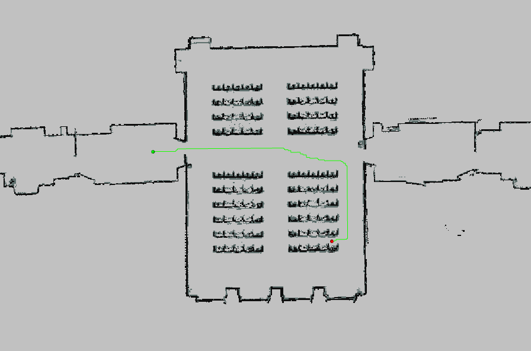
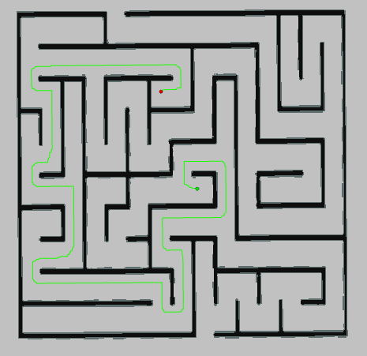
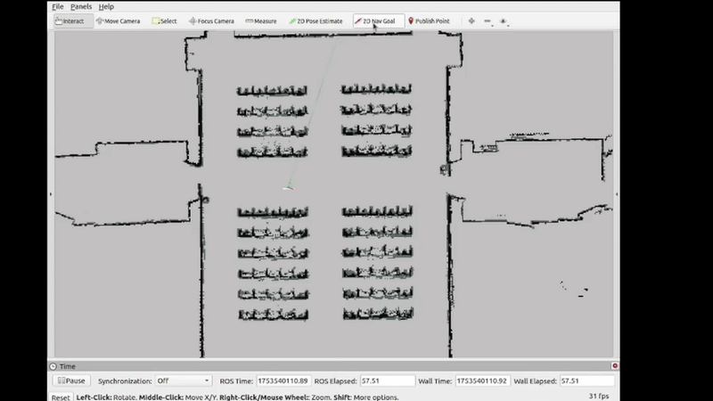

# RP_simple_planner
Repository for the "Robot Programming (2023/2024)" course, part of the MSc in Artificial Intelligence and Robotics at Sapienza University of Rome, developed by Emiliano paradiso (1940454).

## Quick overview
his framework implements a simple path planner using the A* algorithm. The planning cost is computed as the inverse of the distance to the closest obstacle, based on a precomputed distance map. It supports both static maps and localization-based planning using AMCL.

### Examples
<div align="center">
  <table style="border-collapse: collapse; border: none;">
    <tr>
      <td style="border: none;"></td>
      <td style="border: none;"></td>
    </tr>
  </table>
</div>
<div align="center">

</div>


## How to run the code
### 1. Initialize the catkin workspace

```
mkdir -p ~/catkin_ws/src
cd ~/catkin_ws
catkin_make
```

### 2. Clone the repository

```
cd ~/catkin_ws/src
git clone <repository_url>
cd ..
catkin_make
```

### 3.a Launch files
Two launch files are provided:

#### • `simple_planner_node.launch`
Launches the planner for a fixed map setup. RViz is used to set the start and goal positions.
```
roslaunch simple_planner simple_planner_node.launch map_yaml:=<path/to/map.yaml> map_png:=<path/to/map.png>
```

#### • `localized_planner.launch`
Runs the full localization and planning setup with AMCL and Stage simulation (.world file). Use RViz to set the goal pose interactively.
```
roslaunch simple_planner localized_planner.launch
```


### 3.b Manual execution
Alternatively it is possible to run:
- **Static Map (Without Launch File)**
  ```
  roscore
  rosurn map_server map_server <map.yaml>
  rosrun simple_planner planner_node map_yaml:=<map.yaml> map_png:=<map.png>
  rosurn rviz planner rviz
  ```
  In RViz:
  - Set the Fixed Frame to map
  - Use the 2D Pose Estimate tool to set the robot's initial position (if needed)
  - Use 2D Nav Goal to set the target
 
- **Localization Setup (Without Launch File)**
  ```
  roscore
  rosrun map_server map_server <map.yaml>
  rosrun stage_ros stageros <map.world>
  rosrun amcl amcl \
    _use_map_topic:=true \
    _odom_frame_id:=odom \
    _base_frame_id:=base_link \
    _initial_pose_x:=53.3 \
    _initial_pose_y:=11.9 \
    _initial_pose_a:=0.0 \
    scan:=base_scan
  rosrun simple_planner planner_node map_yaml:=<map.yaml> map_png:=<map.png>
  rosrun rviz rviz
  ```
  Then configure RViz as needed to visualize the map, robot, and planned path.

  ## Folder Structure
```text
RP_simple_planner/
├── launch/
│   ├── simple_planner_node.launch
│   └── localized_planner.launch
├── include/
│   └── simple_planner/
│         └── ...
├── src/
│   └── ...
├── sripts_py/
│   └── ...
├── maps/
│   └──...
├── img/
│   ├── diag_plan.png
│   ├── maze_plan.png
│   └── rp.gif
└── README.md
```

  
